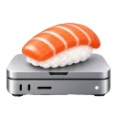

# SushiTray

macOS menu bar app for running and controlling a local [sushi](https://github.com/beamivalice/sushi) AI server.

Start and stop `sushi serve` from the tray, watch live prefill/decode tok/s, browse models, and open the built-in chat UI when the server is ready.

<p align="center">
  
</p>

## Features

- **Start / Stop** the configured `sushi serve` process from the menu bar
- **Tray metrics** — GPU / MEM mini-bars and `P:` / `T:` tok/s parsed from sushi log lines
- **Open chat** — appears under Stop Server when the log reports `chat in your browser: http://…`
- **Models** submenu
  - Server running → OpenAI-compatible `GET /v1/models`
  - Stopped → last cached API list, or disk scan from `--model` / `--model-dir`
- **Agents** submenu — opens Terminal with `sushi launch <agent>` (claude, pi, omp, opencode, codex, hermes, aider) against the local server URL
- **System Stats** — CPU, GPU, memory snapshot
- **Serving Stats** — session prefill/decode and token counts
- **Settings**
  - Editable serve command (UserDefaults)
  - Autostart server (default on)
  - Brew install hint if `sushi` is missing
  - Live log tail
- Injects `--log-file ~/.sushi/logs/sushi.log` and `--parent-pid` when not already set

## Requirements

- macOS 13.0+ (Ventura or later)
- Apple Silicon recommended (sushi / MLX)
- Xcode 15+ command line tools (to build)
- [sushi](https://github.com/beamivalice/sushi) on `PATH`:

```bash
brew install beamivalice/tap/sushi
```

## Build & run

```bash
git clone https://github.com/derkan/SushiTray.git
cd SushiTray
make icons          # regenerate tray/app icons from assets/sushi-icon.png
make run            # debug build → SushiTray.app → launch
# or
make run-release
```

Open `Package.swift` in Xcode if you prefer:

```bash
make xcode
```

### Makefile targets

| Target | Description |
|--------|-------------|
| `make run` / `run-release` | Build, bundle, and launch |
| `make build` / `build-debug` | Compile the executable |
| `make bundle` | Package `SushiTray.app` |
| `make icons` | Generate icons (needs ImageMagick `magick` for tray PNGs) |
| `make clean` | Remove build products and the `.app` |

## Usage

1. Launch **SushiTray** — it appears in the menu bar (no Dock icon; `LSUIElement`).
2. If Autostart is enabled (default), the server starts with your saved command.
3. Click the tray icon for status, Start/Stop, Models, Agents, stats, Settings, About, Quit.
4. When the server logs the chat URL, choose **Open chat** to open it in the browser.
5. Use **Agents ▸** to open a coding agent in Terminal via `sushi launch <agent>` (passes `--url` for the local server and `--model` when configured).

### Default serve command

Stored in Settings (editable). Default:

```text
sushi serve --model ~/.sushi/models/Qwen3.8-Flash-Next-Sushi-2bpw \
  --mtp --kv-quant 8 --mtp-head-kv-quant --ctx-size 128000 \
  --max-tokens 32000 --prefix-cache-disk 20GB --prefix-cache-entries 1 \
  --prefix-cache-mem 1GB --temp 1 --skip-mem-preflight
```

Default listen address is sushi’s own default (`127.0.0.1:12345`) unless you add `--host` / `--port`.

### Log metrics

Prefill and decode speeds are taken from lines like:

```text
  <- 40251+88 tokens streamed [prefill: 129.9 tok/s (...), decode: 71.2 tok/s] [tool_calls]
```

## Project layout

```text
SushiTray/
├── Package.swift          # SwiftPM executable
├── Makefile
├── assets/sushi-icon.png
└── SushiTray/             # sources + Info.plist + icons
    ├── AppDelegate.swift  # NSMenu tray chrome
    ├── Config/
    ├── Server/            # process, log tail, models API
    ├── Views/             # Settings + status bar metrics
    └── Utilities/
```

## Related

- [sushi](https://github.com/beamivalice/sushi) — local MLX AI server
- Homebrew tap: `beamivalice/tap/sushi`

## License

MIT
